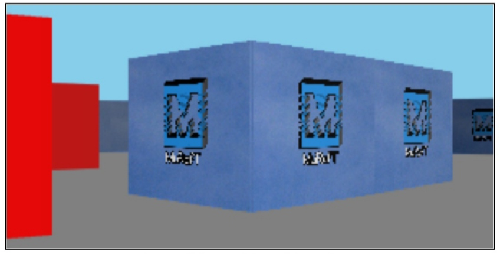

# 3drcJS
A javascript library that allow you to render a Doom-like 3d graphic
## Installation
Import the library with the script tag
```html
<script src="https://muraft.github.io/3drcJS/dist/bundle.js"></script>
```
## Example
```html
<canvas id='screen'></canvas>

<script src="https://muraft.github.io/3drcJS/dist/bundle.js"></script>
<script>
const tdrc = new Tdrc();

const exampleMap={
    data: [1,1,1,1,1,1,1,1,1,1,
           1,0,0,2,0,0,0,0,0,1,
           1,0,0,0,0,0,0,0,0,1,
           1,0,0,1,0,0,2,0,0,1,
           1,0,0,1,1,0,0,0,0,1,
           1,0,0,0,1,0,0,0,0,1,
           1,0,0,0,0,1,0,0,0,1,
           1,0,1,0,0,0,0,1,0,1,
           1,0,1,0,0,0,0,0,0,1,
           1,1,1,1,1,1,1,1,1,1],
     block:{
       1: {texture:'test.jpg'},
       2: {texture:['red','green','blue','yellow']}
     }
    }
    tdrc.setMap(exampleMap);
    tdrc.setGraphic({
      depth:true
    });
    
    tdrc.init();
    
    tdrc.render(document.getElementById('screen');
</script>
```
Result:

For more complex example please look at [example.html](https://github.com/muraft/3drcJS/blob/main/example.html) and see the result [here](https://muraft.github.io/3drcJS/example.html)

## Documentation
Coming soon